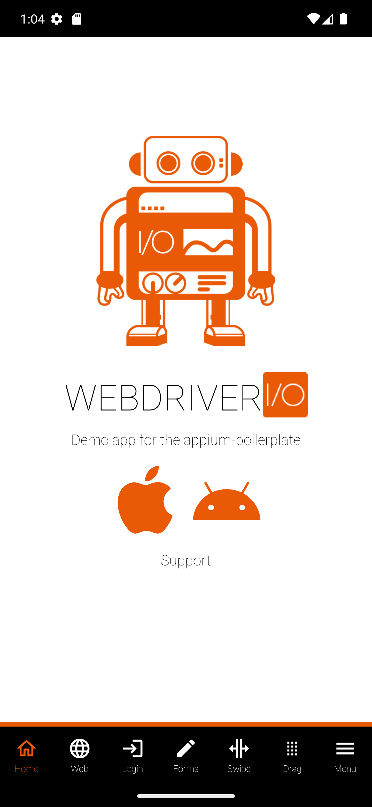

# Appium Android Practice

Mobile test automation practice project built with **Appium** and **WebdriverIO** (JavaScript, Mocha test runner). It runs UI tests against the [WebdriverIO Native Demo App](https://github.com/webdriverio/native-demo-app) on an Android emulator, as a hands-on sample for a QA Automation portfolio.

## Tech stack

- [WebdriverIO](https://webdriver.io/) v9 (`@wdio/cli`, `@wdio/local-runner`)
- [Mocha](https://mochajs.org/) test framework (`@wdio/mocha-framework`)
- [Appium](https://appium.io/) v3 + `@wdio/appium-service` (auto-starts/stops the Appium server)
- Appium **UiAutomator2** driver for Android automation
- GitHub Actions for CI (dependency install check on every push — see [Continuous Integration](#continuous-integration))

## Prerequisites

To run the tests locally you need:

- [Node.js](https://nodejs.org/) 18+ and npm
- [Java JDK](https://adoptium.net/) and the [Android SDK](https://developer.android.com/studio) (`ANDROID_HOME` configured)
- Appium and the UiAutomator2 driver:
  ```bash
  npm install -g appium
  appium driver install uiautomator2
  ```
- An Android emulator (this project targets a `Pixel_7_Pro`, API 33) with the [WebdriverIO Native Demo App](https://github.com/webdriverio/native-demo-app) (`com.wdiodemoapp`) already installed.

## Installation

```bash
git clone <this-repo-url>
cd appium-android-practice
npm install
```

## Running the tests

These tests drive a real Android emulator through Appium, so **they only run locally** — there's no emulator available on GitHub-hosted CI runners for this project (see [Continuous Integration](#continuous-integration)).

1. Start the Android emulator (e.g. via Android Studio's Device Manager or `emulator -avd Pixel_7_Pro`) and make sure the demo app is installed on it.
2. Run the test suite:
   ```bash
   npm test
   ```
   The `@wdio/appium-service` will automatically launch the Appium server on port `4723` before the run and shut it down afterwards, so there's no need to start Appium manually.
3. Each run saves screenshots of key steps to `screenshots/` (see below), plus a `FAILED-*.png` screenshot for any test that fails.

## Test evidence

Screenshots captured by the sample test (`test/specs/app.e2e.js`) against the local emulator:

| App launched | "Login" menu item visible |
| --- | --- |
|  |  |

## Project structure

```
appium-android-practice/
├── .github/
│   └── workflows/
│       └── mobile-tests.yml   # CI: verifies npm dependencies install cleanly (no emulator/tests)
├── screenshots/                # Screenshots saved by test runs (PNGs are gitignored except the committed evidence above)
├── test/
│   └── specs/
│       └── app.e2e.js         # Sample test: verifies the home screen renders the "Login" menu item
├── wdio.conf.js               # WebdriverIO/Appium configuration (capabilities, services, framework, screenshot-on-failure hook)
├── package.json
└── README.md
```

## Continuous Integration

Running an Android emulator on GitHub-hosted runners turned out to be unreliable (long macOS runner queues, then `ECONNREFUSED`/boot-timeout issues even on Linux with KVM). Since this is a practice/portfolio project rather than a team CI pipeline, the workflow in `.github/workflows/mobile-tests.yml` was scaled back to just a **dependency install check**: on every push and pull request to `main`, it checks out the repo and runs `npm ci` to confirm the project's dependencies still install cleanly. It does **not** boot an emulator or run the test suite — that's done locally (see [Running the tests](#running-the-tests)), with the screenshots above as evidence of a passing run.
